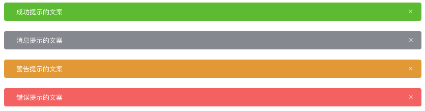
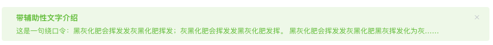

# Element 组件分析——Alert

## TL;DR

很多同学一提到开源项目的代码，都会"色变"，认为自己的基础不好，不足以读懂源代码。本质上讲开源项目也是普通的工程，我们可以把里面的每一个组件都可以当成是一个普通的 UI 组件。因此，我们按照开发流程的角度来看待 `element-ui` 中的代码(组件)。

分别从下面几个流程来分析：

<!-- START doctoc generated TOC please keep comment here to allow auto update -->
<!-- DON'T EDIT THIS SECTION, INSTEAD RE-RUN doctoc TO UPDATE -->

- [分析设计](#%E5%88%86%E6%9E%90%E8%AE%BE%E8%AE%A1)
  - [1. 基本用法](#1-%E5%9F%BA%E6%9C%AC%E7%94%A8%E6%B3%95)
    - [1.1 需求](#11-%E9%9C%80%E6%B1%82)
    - [1.2 分析](#12-%E5%88%86%E6%9E%90)
    - [1.3 实现思路](#13-%E5%AE%9E%E7%8E%B0%E6%80%9D%E8%B7%AF)
    - [1.4 示例简码](#14-%E7%A4%BA%E4%BE%8B%E7%AE%80%E7%A0%81)
  - [2. 主题](#2-%E4%B8%BB%E9%A2%98)
    - [2.1 需求](#21-%E9%9C%80%E6%B1%82)
    - [2.2 实现思路](#22-%E5%AE%9E%E7%8E%B0%E6%80%9D%E8%B7%AF)
    - [2.3 示例简码](#23-%E7%A4%BA%E4%BE%8B%E7%AE%80%E7%A0%81)
  - [3. 自定义关闭按钮](#3-%E8%87%AA%E5%AE%9A%E4%B9%89%E5%85%B3%E9%97%AD%E6%8C%89%E9%92%AE)
    - [3.1 需求](#31-%E9%9C%80%E6%B1%82)
    - [3.2 实现思路](#32-%E5%AE%9E%E7%8E%B0%E6%80%9D%E8%B7%AF)
    - [3.3 示例简码](#33-%E7%A4%BA%E4%BE%8B%E7%AE%80%E7%A0%81)
  - [4. 带有 icon](#4-%E5%B8%A6%E6%9C%89-icon)
    - [4.1 需求](#41-%E9%9C%80%E6%B1%82)
    - [4.2 实现思路](#42-%E5%AE%9E%E7%8E%B0%E6%80%9D%E8%B7%AF)
    - [4.3 示例简码](#43-%E7%A4%BA%E4%BE%8B%E7%AE%80%E7%A0%81)
  - [5. 文字居中](#5-%E6%96%87%E5%AD%97%E5%B1%85%E4%B8%AD)
    - [5.1 需求](#51-%E9%9C%80%E6%B1%82)
    - [5.2 实现思路](#52-%E5%AE%9E%E7%8E%B0%E6%80%9D%E8%B7%AF)
    - [5.3 示例简码](#53-%E7%A4%BA%E4%BE%8B%E7%AE%80%E7%A0%81)
  - [6. 带有辅助性文字介绍](#6-%E5%B8%A6%E6%9C%89%E8%BE%85%E5%8A%A9%E6%80%A7%E6%96%87%E5%AD%97%E4%BB%8B%E7%BB%8D)
    - [6.1 需求](#61-%E9%9C%80%E6%B1%82)
    - [6.2 实现思路](#62-%E5%AE%9E%E7%8E%B0%E6%80%9D%E8%B7%AF)
    - [6.3 示例简码](#63-%E7%A4%BA%E4%BE%8B%E7%AE%80%E7%A0%81)
  - [7. 带有 icon 和辅助性文字介绍：](#7-%E5%B8%A6%E6%9C%89-icon-%E5%92%8C%E8%BE%85%E5%8A%A9%E6%80%A7%E6%96%87%E5%AD%97%E4%BB%8B%E7%BB%8D)
    - [7.1 需求](#71-%E9%9C%80%E6%B1%82)
    - [7.2 实现思路](#72-%E5%AE%9E%E7%8E%B0%E6%80%9D%E8%B7%AF)
    - [7.3 示例代码](#73-%E7%A4%BA%E4%BE%8B%E4%BB%A3%E7%A0%81)
- [具体实现](#%E5%85%B7%E4%BD%93%E5%AE%9E%E7%8E%B0)
  - [布局](#%E5%B8%83%E5%B1%80)
- [总结](#%E6%80%BB%E7%BB%93)

<!-- END doctoc generated TOC please keep comment here to allow auto update -->

## 分析设计

`Alert 警告` 组件用于页面中展示重要的提示信息。我们将根据**需求**设计出每个功能点的实现思路。

详细内容请阅读 [element ui/组件/alert 警告](https://element.eleme.cn/#/zh-CN/component/alert)

### 1. 基本用法

#### 1.1 需求

页面中的非浮层元素，不会自动消失。点击**关闭按钮**的时候，提示条消失。


#### 1.2 分析

从以上的**需求描述**及**示例图**中，我们可以获得以下需求点：

- 非浮层元素，不会自动消失
- 可关闭
- 主题色
- 文本

#### 1.3 实现思路

既然是通用的 UI 组件，那么组件需要对外暴露可以修改的属性(props)以及回调方法(\$emit())，以方便外部自定义属性和方法。

经过分析可以得到以下的实现思路：

- 非浮层元素，不会自动消失：使用 div 来实现这个组件。
- 可关闭：在 `data` 中定义 `visible` 属性，当点击**关闭按钮**时，设置 `this.visible = false`.
- 主题色：在 `props`中定义 `type` 属性，并在组件最外层的 div 上绑定一个 `class` 。根据 `type` 动态改变 `class`。例如： `<div :class="['el-alert--' + type]" />`
- 文本：在 `props` 中定义 `title` 属性，接收外部传递的标题。

#### 1.4 示例简码

html

```vue
<div :class="['el-alert--' + type]" v-show="visible">
  <div>{{ title }}</div>
  <i class="el-icon-close" @click="close" />
</div>
```

script

```vue
<script>
export default {
  props: {
    title: {
      type: String,
      default: ''
    },
    type: {
      type: String,
      default: 'info'
    }
  },
  data() {
    return {
      visible: true
    }
  },
  methods: {
    close() {
      this.visible = false
    }
  }
}
</script>
```

### 2. 主题

#### 2.1 需求

Alert 组件提供两个不同的主题：light 和 dark。



#### 2.2 实现思路

1. 定义两套 css 主题('is-light' 和 'is-dark')。
2. 在 `props`中定义 effect 属性。
3. 在组件最外层定义一个 div，并绑定 `class`，根据 `effect` 来决定使用哪个主题。

#### 2.3 示例简码

html

```vue
<div :class="['is-' + effect]">
  ...
</div>
```

script

```vue
<script>
export default {
  props: {
    effect: {
      type: String,
      default: 'light',
      validator: function (value) {
        // 只能显示 light 或者 dark
        return ['light', 'dark'].indexOf(value) !== -1
      }
    }
  }
}
</script>
```

### 3. 自定义关闭按钮

#### 3.1 需求

自定义关闭按钮为文字或其他符号。


#### 3.2 实现思路

- 不可关闭：在关闭的标签上定义 `v-show` 或者 `v-if`，根据 `closable`(props) 的值来决定是否显示 关闭标签。
- 自定义 `close-text`：定义 `props` 中的 `closeText` 属性，并根据该属性来判断是直接显示自定义文字还是显示文字图标。
- 设置了回调：绑定一个 `click` 事件，点击按钮时，`emit` 该事件。

#### 3.3 示例简码

html

```vue
<div>
  <i :class="{ 'is-customed': closeText !== '', 'el-icon-close': closeText === '' }" v-show="closable" @click="close()">{{closeText}}</i>
</div>
```

script

```vue
<script>
export default {
  props: {
    closable: {
      type: Boolean,
      default: true
    },
    closeText: {
      type: String,
      default: ''
    }
  }
}
</script>
```

### 4. 带有 icon

#### 4.1 需求

带有 icon 表示某种状态时提升可读性。


#### 4.2 实现思路

- 在 `props` 中定义一个 `showIcon` 属性。
- 根据该属性来判断是否显示 icon。
- 根据 `props` 中的 `type` 决定显示哪个 icon。

#### 4.3 示例简码

html

```vue
<i :class="'el-icon-' + type" v-if="showIcon"></i>
```

script

```vue
<script>
export default {
  props: {
    // 判断提示的类型
    type: {
      type: String,
      default: 'info'
    },
    // 判断是否显示 icon
    showIcon: {
      type: Boolean,
      default: true
    }
  }
}
</script>
```

### 5. 文字居中

#### 5.1 需求

使用 center 属性让文字水平居中。


#### 5.2 实现思路

- 在 `props` 中定义一个 `center` 属性。
- 根据该属性来决定是否使用 `is-center` 这个 class。

#### 5.3 示例简码

html

```vue
<div :class="[center ? 'is-center' : '']">
  ...
</div>
```

script

```vue
<script>
export default {
  props: {
    center: {
      type: Boolean,
      default: false
    }
  }
}
</script>
```

### 6. 带有辅助性文字介绍

#### 6.1 需求

包含标题和内容，解释更详细的警告。



#### 6.2 实现思路

- 在 `props` 中定义 `description` 属性。
- 根据该属性来判断是否显示描述信息。

#### 6.3 示例简码

html

```vue
<p v-if="description">{{ description }}</p>
```

script

```vue
<script>
export default {
  props: {
    description: {
      type: String,
      default: ''
    }
  }
}
</script>
```

### 7. 带有 icon 和辅助性文字介绍：

#### 7.1 需求

带有 icon 和辅助性文字介绍


#### 7.2 实现思路

- 定义两个图标样式：大图标和小图标。
- 根据 `props` 中的 `description` 属性来判断显示大图标或者小图标。
- 默认是小图标。

#### 7.3 示例代码

html

```vue
<i :class="description ? 'is-big' : ''"></i>
```

## 具体实现

当我们实现一个组件的功能时，最好是从布局开始，然后再逐一实现这个组件中的功能。

### 1. 布局

### 2. 隐藏不需要的页面元素

### 3. 实现基本功能

- 可关闭
- 主题色
- 文本

#### 3.1 可关闭

1. 在 `data` 中定义 `visible` 属性
2. 在最外层的**div**中定义 `v-show="visible"`
3. 在**关闭按钮**标签中定义 `@click="close"`
4. 触发 `click事件` 时，`this.visible = false`

```vue
<template>
  <!-- 2. 在最外层的**div**中定义 `v-show="visible"` -->
  <div class="el-alert el-alert--info is-light" v-show="visible">
    ...
    <div class="el-alert__content">
      ...
      <!-- 3. 在**关闭按钮**标签中定义 `@click="close"` -->
      <i class="el-alert__closebtn el-icon-close" @click="close"></i>
    </div>
  </div>
</template>

<script>
/**
 * 1. 可关闭
 */
export default {
  name: 'alert-01-basic',
  data() {
    return {
      // 1. 在 `data` 中定义 `visible` 属性
      visible: true
    }
  },
  methods: {
    // 4. 触发 `click事件` 时，`this.visible = false`
    close() {
      this.visible = false
    }
  }
}
</script>
```

#### 3.2 主题色

1. 在 `props` 中定义 `type` 属性。
2. 根据 `type` 决定 `class`。

```vue
<template>
  <div class="el-alert is-light" :class="['el-alert--' + type]" v-show="visible">...</div>
</template>

<script>
/**
 * 1. 可关闭
 * 2. 主题色
 * 3. 文本
 */
export default {
  name: 'alert-01-basic',
  props: {
    type: {
      type: String,
      default: 'info'
    }
  }
  // ...
}
</script>
```

测试：在外部传入`type=success`


### 3.3 文本

1. 在 `props` 中定义 `title` 字段。
2. 在 html 中用 `{{ title }}` 来显示。

```vue
<template>
  <div class="el-alert is-light" :class="['el-alert--' + type]" v-show="visible">
    ...
    <div class="el-alert__content">
      <span class="el-alert__title">
        {{ title }}
      </span>
      ...
    </div>
  </div>
</template>

<script>
/**
 * 1. 可关闭
 * 2. 主题色
 * 3. 文本
 */
export default {
  name: 'alert-01-basic',
  props: {
    // ...
    title: {
      type: String,
      default: ''
    }
  }
  // ...
}
</script>
```

### 3.4 完善

自此 `alert 警告` 组件的基本需求已经完成了。为了提升体验，我们在最外层添加 `transition` 标签，以获得一个动画效果。

```css
.el-alert-fade-enter,
.el-alert-fade-leave-active {
  opacity: 0;
}
```

### 3.5 优化

我们都知道在页面当中最容易变化的就是 html 和样式了。我们尽可能的使 html 部分看起来简单、整洁，以便于后期的维护。因此我们把所有的数据处理全部都放到 script 中。

- 使用 computed 的 `typeClass` 代替 html 中的判断。

```vue
<template>
  <transition name="el-alert-fade">
    <div class="el-alert is-light" :class="[typeClass]" v-show="visible">...</div>
  </transition>
</template>

<script>
export default {
  // ...
  computed: {
    typeClass() {
      return 'el-alert--' + this.type
    }
  }
}
</script>
```

完整代码：[/src/components/alert-01-basic/src/main.vue](../../samples/alert/src/components/alert-01-basic/src/main.vue)

## 主题

Alert 组件提供两个不同的主题：light 和 dark。


1. 定义两套 css 主题('is-light' 和 'is-dark')。
2. 在 `props`中定义 effect 属性。
3. 在组件最外层定义一个 div，并绑定 `class`，根据 `effect` 来决定使用哪个主题。

```vue
<template>
  <transition name="el-alert-fade">
    <div class="el-alert is-light" :class="[typeClass, effectClass]" v-show="visible">...</div>
  </transition>
</template>

<script>
export default {
  name: 'alert-02-theme',
  props: {
    // 2. 在 `props`中定义 effect 属性。
    effect: {
      type: String,
      default: 'light',
      validate(value) {
        return ['light', 'dark'].indexOf(value) !== -1
      }
    }
    // ...
  },
  computed: {
    // 3. 在组件最外层定义一个 div，并绑定 `class`，根据 `effect` 来决定使用哪个主题。
    effectClass() {
      return 'is-' + this.effect
    }
    // ...
  }
  // ...
}
</script>
```

测试：在外部传入 `effect="dark"`


完整代码：[/src/components/alert-02-theme/src/main.vue](../../samples/alert/src/components/alert-02-theme/src/main.vue)

### 自定义关闭按钮

#### 3.1 需求

自定义关闭按钮为文字或其他符号。


- 不可关闭：在关闭的标签上定义 `v-show` 或者 `v-if`，根据 `closable`(props) 的值来决定是否显示 关闭标签。
- 自定义 `close-text`：定义 `props` 中的 `closeText` 属性，并根据该属性来判断是直接显示自定义文字还是显示文字图标。
- 设置了回调：绑定一个 `click` 事件，点击按钮时，`emit` 该事件。

##### 不可关闭

在关闭的标签上定义 `v-show` 或者 `v-if`，根据 `closable`(props) 的值来决定是否显示 关闭标签。

```vue
<template>
  <i class="el-alert__closebtn el-icon-close" v-if="closable"></i>
</template>

<script>
export default {
  name: 'alert-03-close-btn',
  props: {
    closable: {
      type: Boolean,
      default: true
    }
  }
}
</script>
```

##### 自定义 `close-text`

定义 `props` 中的 `closeText` 属性，并根据该属性来判断是直接显示自定义文字还是显示文字图标。

- 使用 computed 来判断是使用自定义文字还是文字图标。

```vue
<template>
  <i class="el-alert__closebtn" :class="[closeClass]" v-if="closable">
    {{ closeText }}
  </i>
</template>
<script>
export default {
  computed: {
    closeClass() {
      return this.closeText === '' ? 'el-icon-close' : 'is-customed'
    }
  }
}
</script>
```

##### 设置回调

绑定一个 `click` 事件，点击按钮时，`emit` 该事件。

```vue
<template>
  <i class="el-alert__closebtn" @click="close">
    {{ closeText }}
  </i>
</template>
<script>
export default {
  methods: {
    close() {
      this.visible = false
      this.$emit('close')
    }
  }
}
</script>
```

#### 跟 关闭按钮相关的代码

```vue
<template>
  <i class="el-alert__closebtn" :class="[closeClass]" v-if="closable" @click="close">
    {{ closeText }}
  </i>
</template>
<script>
export default {
  props: {
    closable: {
      type: Boolean,
      default: true
    }
  },
  methods: {
    close() {
      this.visible = false
      this.$emit('close')
    }
  },
  computed: {
    closeClass() {
      return this.closeText === '' ? 'el-icon-close' : 'is-customed'
    }
  }
}
</script>
```

测试：

```vue
<alert-03-close-btn type="success" title="不可关闭的alert" :closable="false" />
<br />
<alert-03-close-btn type="info" title="自定义 close-text" :close-text="'知道了'" />
<br />
<alert-03-close-btn type="warning" title="设置了回调的alert" @close="close" />
```


完整代码：[/src/components/alert-03-close-btn/src/main.vue](../../samples/alert/src/components/alert-03-close-btn/src/main.vue)

### 4. 带有 icon

#### 4.1 需求

带有 icon 表示某种状态时提升可读性。


#### 4.2 实现思路

- 在 `props` 中定义一个 `showIcon` 属性。
- 根据该属性来判断是否显示 icon。
- 根据 `props` 中的 `type` 决定显示哪个 icon。

```vue
<template>
  <i class="el-alert__icon" :class="[iconClass, isBig]" v-if="showIcon"></i>
</template>
<script>
export default {
  name: 'alert-04-icon',
  props: {
    showIcon: {
      type: Boolean,
      default: false
    }
  },
  computed: {
    iconClass() {
      return 'el-icon-' + this.type
    },
    // TODO 在判断实现辅助提示功能时实现
    isBig() {
      return ''
    }
  }
}
</script>
```

注意：此时 `is-big` 还未使用，我们先指定一个空的字符串，并用 `// TODO` 注释以免忘记实现。

测试：

完整代码：[/src/components/alert-04-icon/src/main.vue](../../samples/alert/src/components/alert-04-icon/src/main.vue)

### 文字居中

#### 5.1 需求

使用 center 属性让文字水平居中。


#### 5.2 实现思路

- 在 `props` 中定义一个 `center` 属性。
- 根据该属性来决定是否使用 `is-center` 这个 class。

```vue
<template>
  <div class="el-alert is-light" :class="[typeClass, effectClass, isCenter]" v-show="visible">...</div>
</template>

<script>
export default {
  props: {
    center: {
      type: Boolean,
      default: false
    }
  },
  computed: {
    isCenter() {
      return this.center ? 'is-center' : ''
    }
  }
}
</script>
```

测试：传入 `:center="true"`


完整代码：[/src/components/alert-05-center/src/main.vue](../../samples/alert/src/components/alert-05-center/src/main.vue)

### 6. 带有辅助性文字介绍

#### 6.1 需求

包含标题和内容，解释更详细的警告。


#### 6.2 实现思路

- 在 `props` 中定义 `description` 属性。
- 根据该属性来判断是否显示描述信息。

此外

- 定义 `isBoldTitle` 来根据 `description` 属性来决定是否加深标题的颜色。
- 当没有 title 的时候，单独显示 `description`。

```vue
<template>
  <div class="el-alert__content">
    <span class="el-alert__title" :class="[isBoldTitle]" v-if="title">
      {{ title }}
    </span>
    <p class="el-alert__description" v-if="description">{{ description }}</p>
  </div>
</template>

<script>
export default {
  props: {
    description: {
      type: String,
      default: ''
    }
  },
  computed: {
    isBoldTitle() {
      return this.description ? 'is-bold' : ''
    }
  }
}
</script>
```

测试

```vue
<alert-06-description
  type="success"
  title="带辅助性的文字介绍"
  description="文字说明文字说明文字说明文字说明文字说明文字说明"
/>
```


完整代码：[/src/components/alert-06-description/src/main.vue](../../samples/alert/src/components/alert-06-description/src/main.vue)

### 7. 带有 icon 和辅助性文字介绍：

#### 7.1 需求

带有 icon 和辅助性文字介绍


#### 7.2 实现思路

- 定义两个图标样式：大图标和小图标。
- 根据 `props` 中的 `description` 属性来判断显示大图标或者小图标。
- 默认是小图标。

```vue
<template>
  <i class="el-alert__icon" :class="[iconClass, isBig]" v-if="showIcon"></i>
</template>

<script>
export default {
  props: {
    description: {
      type: String,
      default: ''
    }
  },
  computed: {
    isBig() {
      return this.description ? 'is-big' : ''
    }
  }
}
</script>
```

测试

```vue
<alert-07-description-icon
  type="success"
  title="带辅助性的文字介绍"
  description="文字说明文字说明文字说明文字说明文字说明文字说明"
  :show-icon="true"
/>
```


完整代码：[/src/components/alert-07-description-icon/src/main.vue](../../samples/alert/src/components/alert-07-description-icon/src/main.vue)

### 添加插槽

添加两个插槽

- title
- description

注意：之前判断 `title` 和 `description` 非空的地方，现在需要加上 `$slots.title` 和 `$slots.default` 判断。

```vue
<template>
  <transition name="el-alert-fade">
    <div class="el-alert__content">
      <span class="el-alert__title" :class="[isBoldTitle]" v-if="title || $slots.title">
        <slot name="title">
          {{ title }}
        </slot>
      </span>
      <p class="el-alert__description" v-if="description || $slots.default">
        <slot>
          {{ description }}
        </slot>
      </p>
    </div>
  </transition>
</template>

<script>
export default {
  props: {
    title: {
      type: String,
      default: ''
    },
    description: {
      type: String,
      default: ''
    }
  },
  computed: {
    isBig() {
      return this.description || this.$slots.default ? 'is-big' : ''
    },
    isBoldTitle() {
      return this.description || this.$slots.default ? 'is-bold' : ''
    }
  }
}
</script>
```

## 总结

- 所有的计算全部都放到 computed 中，让 html 尽量简洁。
