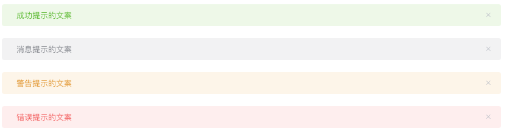
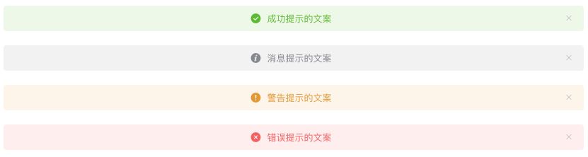

# Element 组件分析——Alert

由于这篇文档肩负着 `分享` 和 `阅读`

## TL;DR

本质上讲开源项目也是普通的工程，里面的每一个组件都可以当成是一个普通的 UI 组件。因此，我们按照开发流程的角度来看待 `element-ui` 中的代码(组件)。

分别从下面几个流程来分析：

<!-- START doctoc generated TOC please keep comment here to allow auto update -->
<!-- DON'T EDIT THIS SECTION, INSTEAD RE-RUN doctoc TO UPDATE -->

- [需求分析](#%E9%9C%80%E6%B1%82%E5%88%86%E6%9E%90)
- [具体实现](#%E5%85%B7%E4%BD%93%E5%AE%9E%E7%8E%B0)
  - [整体](#%E6%95%B4%E4%BD%93)
    - [思考](#%E6%80%9D%E8%80%83)
  - [最外层](#%E6%9C%80%E5%A4%96%E5%B1%82)
  - [图标](#%E5%9B%BE%E6%A0%87)
  - [主体内容](#%E4%B8%BB%E4%BD%93%E5%86%85%E5%AE%B9)
    - [标题](#%E6%A0%87%E9%A2%98)
    - [警告描述](#%E8%AD%A6%E5%91%8A%E6%8F%8F%E8%BF%B0)
    - [关闭按钮](#%E5%85%B3%E9%97%AD%E6%8C%89%E9%92%AE)
- [总结](#%E6%80%BB%E7%BB%93)

<!-- END doctoc generated TOC please keep comment here to allow auto update -->

## 需求

`Alert 警告` 组件用于页面中展示重要的提示信息。

### 1. 基本用法

页面中的非浮层元素，不会自动消失。点击关闭按钮的时候，提示条消失。



分析：从以上的**需求描述**及**示例图**中，我们可以获得以下需求点：

- 非浮层元素，不会自动消失
- 可关闭
- 主题色
- 文本

既然是通用的 UI 组件，那么组件需要对外暴露可以修改的属性(props)以及回调方法(\$emit())，以方便外部自定义属性和方法。

经过分析可以得到以下的实现思路：

- 非浮层元素，不会自动消失： 使用 div 来实现这个组件。
- 可关闭：在 `data` 中定义 `visible` 属性，并在点击关闭按钮时，设置 `this.visible = false`.
- 主题色：在 `props`中定义 `type` 属性，并在组件最外层的 div 上绑定一个`主题class`，根据 `type` 动态改变 `class`。
- 文本：在 `props` 中定义 `title` 属性，用来接收外部注入的 "提示文案"。
- 为了增强体验，我们添加一个 `transition` 标签来体现消失效果。

简码：

html

```vue
<transition>
  <div :class="['el-alert--' + type]" v-show="visible">
    <div>{{ title }}</div>
    <i>x</i>
  </div>
</transition>
```

script

```vue
<script>
export default {
  props: {
    title: {
      type: String,
      default: ''
    },
    type: {
      type: String,
      default: 'info'
    }
  },
  data() {
    return {
      visible: true
    }
  },
  methods: {
    close() {
      this.visible = false
      this.$emit('close')
    }
  }
}
</script>
```

### 2. 主题

Alert 组件提供两个不同的主题：light 和 dark。


实现思路：

1. 定义两套 css 主题('is-light' 和 'is-dark')。
2. 在 `props`中定义 effect 属性。
3. 在组件最外层定义一个 div，并绑定 `class`，根据 `effect` 来决定使用哪个主题。

html： 在 div 中添加 class

```vue
<div :class="['el-alert--' + type, 'is-' + effect]" v-show="visible">
  ...
</div>
```

script

```vue
<script>
export default {
  props: {
    effect: {
      type: String,
      default: 'light',
      validator: function (value) {
        return ['light', 'dark'].indexOf(value) !== -1
      }
    }
  }
}
</script>
```

### 自定义关闭按钮

自定义关闭按钮为文字或其他符号。


实现思路：

- 不可关闭：在关闭的标签上定义 `v-show` 或者 `v-if`，根据 `closable`(props) 的值来决定是否显示 关闭标签。
- 自定义 `close-text`：定义 `props` 中的 `closeText` 属性，并根据该属性来判断是直接显示自定义文字还是显示文字图标。
- 设置了回调：绑定一个 `click` 事件，点击按钮时，`emit` 该事件。

html

```vue
<div>
  <i :class="{ 'is-customed': closeText !== '', 'el-icon-close': closeText === '' }" v-show="closable" @click="close()">{{closeText}}</i>
</div>
```

### 带有 icon：表示某种状态时提升可读性。


- 文字居中：使用 center 属性让文字水平居中。



- 带有辅助性文字介绍：包含标题和内容，解释更详细的警告。


- 带有 icon 和辅助性文字介绍：


详细内容请阅读 [element ui- alert 警告](https://element.eleme.cn/#/zh-CN/component/alert)

## 需求分析

### 基本用法

#### 描述：页面中的非浮层元素，不会自动消失。点击关闭按钮的时候，提示条消失。


- props：title、type(不同类型的主题)、closable(是否可关闭)
- 不同类型的主题(success/warning/info/error)：

## 具体实现

### 整体

#### 思考

### 最外层

### 图标

### 主体内容

#### 标题

#### 警告描述

#### 关闭按钮

## 总结

- 所有的计算全部都放到 computed 中，让 html 尽量简洁。
