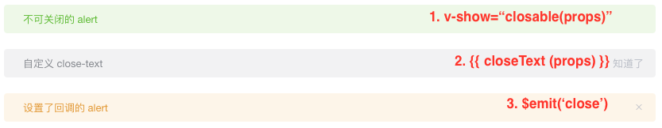

# 【详细设计】 `Alert 警告` 组件

`Alert 警告` 组件用于页面中展示重要的提示信息。详细需求阅读 [【Alert 警告】文档](https://element.eleme.cn/#/zh-CN/component/alert) 。

我们将根据**需求**设计出每个功能点的实现思路。

<!-- START doctoc generated TOC please keep comment here to allow auto update -->
<!-- DON'T EDIT THIS SECTION, INSTEAD RE-RUN doctoc TO UPDATE -->

- [布局](#%E5%B8%83%E5%B1%80)
- [功能设计](#%E5%8A%9F%E8%83%BD%E8%AE%BE%E8%AE%A1)
  - [1. 基本用法](#1-%E5%9F%BA%E6%9C%AC%E7%94%A8%E6%B3%95)
    - [1.1 需求](#11-%E9%9C%80%E6%B1%82)
    - [1.2 分析](#12-%E5%88%86%E6%9E%90)
    - [1.3 实现思路](#13-%E5%AE%9E%E7%8E%B0%E6%80%9D%E8%B7%AF)
    - [1.4 关键代码](#14-%E5%85%B3%E9%94%AE%E4%BB%A3%E7%A0%81)
  - [2. 主题](#2-%E4%B8%BB%E9%A2%98)
    - [2.1 需求](#21-%E9%9C%80%E6%B1%82)
    - [2.2 实现思路](#22-%E5%AE%9E%E7%8E%B0%E6%80%9D%E8%B7%AF)
    - [2.3 关键代码](#23-%E5%85%B3%E9%94%AE%E4%BB%A3%E7%A0%81)
  - [3. 自定义关闭按钮](#3-%E8%87%AA%E5%AE%9A%E4%B9%89%E5%85%B3%E9%97%AD%E6%8C%89%E9%92%AE)
    - [3.1 需求](#31-%E9%9C%80%E6%B1%82)
    - [3.2 实现思路](#32-%E5%AE%9E%E7%8E%B0%E6%80%9D%E8%B7%AF)
    - [3.3 关键代码](#33-%E5%85%B3%E9%94%AE%E4%BB%A3%E7%A0%81)
  - [4. 带有 icon](#4-%E5%B8%A6%E6%9C%89-icon)
    - [4.1 需求](#41-%E9%9C%80%E6%B1%82)
    - [4.2 实现思路](#42-%E5%AE%9E%E7%8E%B0%E6%80%9D%E8%B7%AF)
    - [4.3 关键代码](#43-%E5%85%B3%E9%94%AE%E4%BB%A3%E7%A0%81)
  - [5. 文字居中](#5-%E6%96%87%E5%AD%97%E5%B1%85%E4%B8%AD)
    - [5.1 需求](#51-%E9%9C%80%E6%B1%82)
    - [5.2 实现思路](#52-%E5%AE%9E%E7%8E%B0%E6%80%9D%E8%B7%AF)
    - [5.3 关键代码](#53-%E5%85%B3%E9%94%AE%E4%BB%A3%E7%A0%81)
  - [6. 带有辅助性文字介绍](#6-%E5%B8%A6%E6%9C%89%E8%BE%85%E5%8A%A9%E6%80%A7%E6%96%87%E5%AD%97%E4%BB%8B%E7%BB%8D)
    - [6.1 需求](#61-%E9%9C%80%E6%B1%82)
    - [6.2 实现思路](#62-%E5%AE%9E%E7%8E%B0%E6%80%9D%E8%B7%AF)
    - [6.3 关键代码](#63-%E5%85%B3%E9%94%AE%E4%BB%A3%E7%A0%81)
  - [7. 带有 icon 和辅助性文字介绍](#7-%E5%B8%A6%E6%9C%89-icon-%E5%92%8C%E8%BE%85%E5%8A%A9%E6%80%A7%E6%96%87%E5%AD%97%E4%BB%8B%E7%BB%8D)
    - [7.1 需求](#71-%E9%9C%80%E6%B1%82)
    - [7.2 实现思路](#72-%E5%AE%9E%E7%8E%B0%E6%80%9D%E8%B7%AF)
    - [7.3 示例代码](#73-%E7%A4%BA%E4%BE%8B%E4%BB%A3%E7%A0%81)

<!-- END doctoc generated TOC please keep comment here to allow auto update -->

## 布局

我们根据 [【Alert 警告】文档](https://element.eleme.cn/#/zh-CN/component/alert) 中的介绍可以了解到，这个组件主要是有两种布局、四种配色(x2)、四种图标。

布局一：


布局二：


根据上面 UI 设计稿，我们可以以 `布局二` 作为总的布局方案。然后，简单的样式调整就可以把 `布局二` 改成`布局一`：

a. 修改文字图标的 `font-size`；
b. 修改标题的 `font-weight`；
c. 隐藏文字说明部分；


## 功能设计

### 1. 基本用法

#### 1.1 需求

页面中的非浮层元素，不会自动消失。点击**关闭按钮**的时候，提示条消失。


#### 1.2 分析

从以上的**需求描述**及**示例图**中，我们按照**从外向内**、**从结构到细节**的顺序可以获得以下需求点：

- 非浮层元素，不会自动消失
- 可关闭
- 主题色
- 文本

#### 1.3 实现思路

既然 `Alert 警告` 是通用的 UI 组件，那么这个组件需要对外暴露**可供修改**的属性(props)以及回调方法(\$emit())，以便于复用者自定义属性和方法。

经过分析可以得到以下的实现思路：

- 非浮层元素，不会自动消失：使用 div 来实现这个组件（这是一句废话）。
- 可关闭：在 `data` 中定义 `visible` 属性，当点击**关闭按钮**时，设置 `this.visible = false`.
- 主题色：在 `props`中定义 `type` 属性，并在组件最外层的 div 上绑定一个 `class` 。根据 `type` 动态改变 `class`。例如： `<div :class="['el-alert--' + type]" />`
- 文本：在 `props` 中定义 `title` 属性，接收外部传递的标题。


#### 1.4 关键代码

html

```vue
<div :class="['el-alert--' + type]" v-show="visible">
  <div>{{ title }}</div>
  <i class="el-icon-close" @click="close" />
</div>
```

script

```vue
<script>
export default {
  props: {
    title: {
      type: String,
      default: ''
    },
    type: {
      type: String,
      default: 'info'
    }
  },
  data() {
    return {
      visible: true
    }
  },
  methods: {
    close() {
      this.visible = false
    }
  }
}
</script>
```

### 2. 主题

#### 2.1 需求

Alert 组件提供两个不同的主题：light 和 dark。


#### 2.2 实现思路

1. 定义两套 css 主题('is-light' 和 'is-dark')。
2. 在 `props`中定义 `effect` 属性。
3. 在组件最外层的 div 上绑定 `class`，根据 `effect(props)` 来决定使用哪个主题。


#### 2.3 关键代码

html

```vue
<div :class="['is-' + effect]">
  ...
</div>
```

script

```vue
<script>
export default {
  props: {
    effect: {
      type: String,
      default: 'light',
      validator: function (value) {
        // 只能显示 light 或者 dark
        return ['light', 'dark'].indexOf(value) !== -1
      }
    }
  }
}
</script>
```

### 3. 自定义关闭按钮

#### 3.1 需求

自定义关闭按钮为文字或其他符号。


#### 3.2 实现思路

- 不可关闭：在关闭的标签上定义 `v-show` 或者 `v-if`，根据 `closable`(props) 的值来决定是否显示 关闭标签。考虑到标签复用，我们使用 `v-show` 。
- 自定义 `close-text`：定义 `props` 中的 `closeText` 属性，并根据该属性来判断是直接显示自定义文字还是显示文字图标。
- 设置了回调：绑定一个 `click` 事件，点击按钮时，`emit` 该事件。



#### 3.3 关键代码

html

```vue
<div>
  <i :class="closeText === '' ? 'el-icon-close' : 'is-customed'" v-show="closable" @click="close">{{closeText}}</i>
</div>
```

script

```vue
<script>
export default {
  props: {
    closable: {
      type: Boolean,
      default: true
    },
    closeText: {
      type: String,
      default: ''
    }
  },
  methods: {
    close() {
      this.visible = false
      this.$emit('close')
    }
  }
}
</script>
```

### 4. 带有 icon

#### 4.1 需求

带有 icon 表示某种状态时提升可读性。


#### 4.2 实现思路

- 在 `props` 中定义一个 `showIcon` 属性。
- 根据该属性来判断是否显示 icon。
- 根据 `props` 中的 `type` 决定显示哪个 icon。


#### 4.3 关键代码

html

```vue
<i :class="'el-icon-' + type" v-if="showIcon"></i>
```

script

```vue
<script>
export default {
  props: {
    // 判断提示的类型
    type: {
      type: String,
      default: 'info'
    },
    // 判断是否显示 icon
    showIcon: {
      type: Boolean,
      default: true
    }
  }
}
</script>
```

### 5. 文字居中

#### 5.1 需求

使用 center 属性让文字水平居中。


#### 5.2 实现思路

- 在 `props` 中定义一个 `center` 属性。
- 根据该属性来决定是否使用 `is-center` 这个 class。


#### 5.3 关键代码

html

```vue
<div :class="[center ? 'is-center' : '']">
  ...
</div>
```

script

```vue
<script>
export default {
  props: {
    center: {
      type: Boolean,
      default: false
    }
  }
}
</script>
```

### 6. 带有辅助性文字介绍

#### 6.1 需求

包含标题和内容，解释更详细的警告。


#### 6.2 实现思路

- 在 `props` 中定义 `description` 属性。
- 根据该属性来判断是否显示描述信息，
- 根据该属性来判断是否调整 `title` 的 `font-size`。
- 如果 `title` 没有内容，单独显示 `description`。


#### 6.3 关键代码

html

```vue
<template>
  <span :class="description ? 'is-bold' : ''" v-if="title">
    {{ title }}
  </span>
  <p v-if="description">{{ description }}</p>
</template>
```

script

```vue
<script>
export default {
  props: {
    title: {
      type: String,
      default: ''
    },
    description: {
      type: String,
      default: ''
    }
  }
}
</script>
```

### 7. 带有 icon 和辅助性文字介绍

#### 7.1 需求

带有 icon 和辅助性文字介绍


#### 7.2 实现思路

- 定义两个图标样式：大图标和小图标。
- 根据 `props` 中的 `description` 属性来判断显示大图标或者小图标。
- 默认是小图标。

#### 7.3 示例代码

html

```vue
<i :class="description ? 'is-big' : ''"></i>
```
