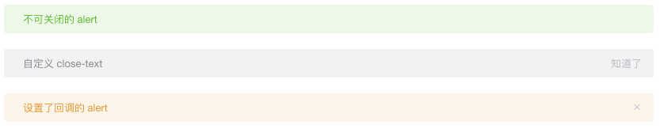
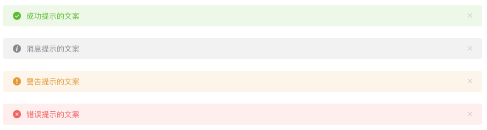

# 【分析】 `Alert 警告` 组件

`Alert 警告` 组件用于页面中展示重要的提示信息。详细内容推荐阅读 [【Alert 警告】文档](https://element.eleme.cn/#/zh-CN/component/alert) 。

我们将根据**需求**设计出每个功能点的实现思路。

## 需求-1：基本用法

### 1.1 需求

页面中的非浮层元素，不会自动消失。点击**关闭按钮**的时候，提示条消失。


### 1.2 分析

从以上的**需求描述**及**示例图**中，我们按照**从外向内**、**从结构到细节**的顺序可以获得以下需求点：

- 非浮层元素，不会自动消失
- 可关闭
- 主题色
- 文本

### 1.3 实现思路

既然是通用的 UI 组件，那么组件需要对外暴露可以修改的属性(props)以及回调方法(\$emit())，以方便外部自定义属性和方法。

经过分析可以得到以下的实现思路：

- 非浮层元素，不会自动消失：使用 div 来实现这个组件。
- 可关闭：在 `data` 中定义 `visible` 属性，当点击**关闭按钮**时，设置 `this.visible = false`.
- 主题色：在 `props`中定义 `type` 属性，并在组件最外层的 div 上绑定一个 `class` 。根据 `type` 动态改变 `class`。例如： `<div :class="['el-alert--' + type]" />`
- 文本：在 `props` 中定义 `title` 属性，接收外部传递的标题。

#### 1.4 示例简码

html

```vue
<div :class="['el-alert--' + type]" v-show="visible">
  <div>{{ title }}</div>
  <i class="el-icon-close" @click="close" />
</div>
```

script

```vue
<script>
export default {
  props: {
    title: {
      type: String,
      default: ''
    },
    type: {
      type: String,
      default: 'info'
    }
  },
  data() {
    return {
      visible: true
    }
  },
  methods: {
    close() {
      this.visible = false
    }
  }
}
</script>
```

### 2. 主题

#### 2.1 需求

Alert 组件提供两个不同的主题：light 和 dark。


#### 2.2 实现思路

1. 定义两套 css 主题('is-light' 和 'is-dark')。
2. 在 `props`中定义 effect 属性。
3. 在组件最外层定义一个 div，并绑定 `class`，根据 `effect` 来决定使用哪个主题。

#### 2.3 示例简码

html

```vue
<div :class="['is-' + effect]">
  ...
</div>
```

script

```vue
<script>
export default {
  props: {
    effect: {
      type: String,
      default: 'light',
      validator: function (value) {
        // 只能显示 light 或者 dark
        return ['light', 'dark'].indexOf(value) !== -1
      }
    }
  }
}
</script>
```

### 3. 自定义关闭按钮

#### 3.1 需求

自定义关闭按钮为文字或其他符号。



#### 3.2 实现思路

- 不可关闭：在关闭的标签上定义 `v-show` 或者 `v-if`，根据 `closable`(props) 的值来决定是否显示 关闭标签。
- 自定义 `close-text`：定义 `props` 中的 `closeText` 属性，并根据该属性来判断是直接显示自定义文字还是显示文字图标。
- 设置了回调：绑定一个 `click` 事件，点击按钮时，`emit` 该事件。

#### 3.3 示例简码

html

```vue
<div>
  <i :class="{ 'is-customed': closeText !== '', 'el-icon-close': closeText === '' }" v-show="closable" @click="close()">{{closeText}}</i>
</div>
```

script

```vue
<script>
export default {
  props: {
    closable: {
      type: Boolean,
      default: true
    },
    closeText: {
      type: String,
      default: ''
    }
  }
}
</script>
```

### 4. 带有 icon

#### 4.1 需求

带有 icon 表示某种状态时提升可读性。



#### 4.2 实现思路

- 在 `props` 中定义一个 `showIcon` 属性。
- 根据该属性来判断是否显示 icon。
- 根据 `props` 中的 `type` 决定显示哪个 icon。

#### 4.3 示例简码

html

```vue
<i :class="'el-icon-' + type" v-if="showIcon"></i>
```

script

```vue
<script>
export default {
  props: {
    // 判断提示的类型
    type: {
      type: String,
      default: 'info'
    },
    // 判断是否显示 icon
    showIcon: {
      type: Boolean,
      default: true
    }
  }
}
</script>
```

### 5. 文字居中

#### 5.1 需求

使用 center 属性让文字水平居中。


#### 5.2 实现思路

- 在 `props` 中定义一个 `center` 属性。
- 根据该属性来决定是否使用 `is-center` 这个 class。

#### 5.3 示例简码

html

```vue
<div :class="[center ? 'is-center' : '']">
  ...
</div>
```

script

```vue
<script>
export default {
  props: {
    center: {
      type: Boolean,
      default: false
    }
  }
}
</script>
```

### 6. 带有辅助性文字介绍

#### 6.1 需求

包含标题和内容，解释更详细的警告。


#### 6.2 实现思路

- 在 `props` 中定义 `description` 属性。
- 根据该属性来判断是否显示描述信息。

#### 6.3 示例简码

html

```vue
<p v-if="description">{{ description }}</p>
```

script

```vue
<script>
export default {
  props: {
    description: {
      type: String,
      default: ''
    }
  }
}
</script>
```

### 7. 带有 icon 和辅助性文字介绍：

#### 7.1 需求

带有 icon 和辅助性文字介绍


#### 7.2 实现思路

- 定义两个图标样式：大图标和小图标。
- 根据 `props` 中的 `description` 属性来判断显示大图标或者小图标。
- 默认是小图标。

#### 7.3 示例代码

html

```vue
<i :class="description ? 'is-big' : ''"></i>
```
