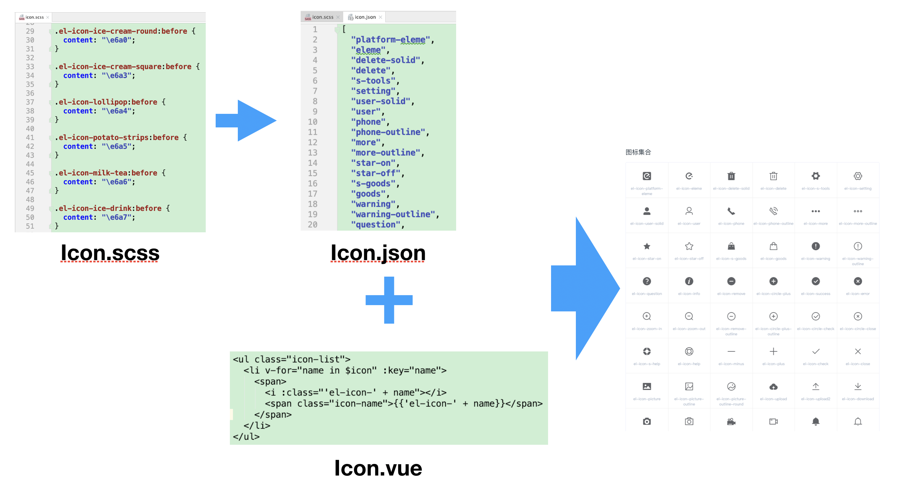

# 【element-ui 源代码】目录

## TL;DR

## 项目文件

分析一个工程，最好是先从目录结构开始。
具体如下：

```
element-dev-2.13.2/
├── .github/            // element-ui的贡献指南、issue和PR模板
├── build/              // 打包相关的配置
├── examples/           // 官网的代码
├── packages/           // 存放组件的文件夹
├── src/                // 存放入口文件和一些工具辅助函数
├── test/               // 测试文件夹
├── types/              // 类型声明文件
├── .babelrc            // babel 的配置文件
├── .eslintignore       // eslint 的忽略文件
├── .eslintrc           // eslint的配置
├── .travis.yml         // github cicd 工具
├── CHANGELOG.en-US.md
├── CHANGELOG.es.md
├── CHANGELOG.fr-FR.md
├── CHANGELOG.zh-CN.md
├── FAQ.md
├── LICENSE
├── Makefile            // 输入 make 命令将会执行 Makefile 文件中的某个命令
├── README.md
├── components.json     // 标明了组件的文件路径，打包的时候自动引入相关的组件
├── element_logo.svg    // logo
├── package.json        // package.json
└── yarn.lock
```

## package.json

```
{
  "name": "element-ui",
  "version": "2.13.2",
  "description": "A Component Library for Vue.js.",
  "main": "lib/element-ui.common.js",
  "files": [
    "lib",
    "src",
    "packages",
    "types"
  ],
  "typings": "types/index.d.ts",
  "scripts": {
    ...
  },
  "faas": [
    {
      "domain": "element",
      "public": "temp_web/element"
    },
    {
      "domain": "element-theme",
      "public": "examples/element-ui",
      "build": [
        "yarn",
        "npm run deploy:build"
      ]
    }
  ],
  "repository": {
    "type": "git",
    "url": "git@github.com:ElemeFE/element.git"
  },
  "homepage": "http://element.eleme.io",
  "keywords": [
    "eleme",
    "vue",
    "components"
  ],
  "license": "MIT",
  "bugs": {
    "url": "https://github.com/ElemeFE/element/issues"
  },
  "unpkg": "lib/index.js",
  "style": "lib/theme-chalk/index.css",
  "dependencies": {
    ...
  },
  "peerDependencies": {
    "vue": "^2.5.17"
  },
  "devDependencies": {
    ...
  }
}

```

- name: 【必须字段】当前模块/包名称。这个名字会作为参数被传入 require()，所以它应该短且意义清晰。长度必须小于等于 214 个字符，不能以"."(点)或者"\_"(下划线)开头，不能包含大写字母。
- version: 【必须字段】当前包的版本号，初次建立默认为 1.0.0 (格式：大版本.次要版本.小版本)。这个字段可以显示当前项目的版本迭代进度。
- description: 当前包的描述信息，是一个字符串。这个字段有助于别人搜索你的项目。如果 package.json 中没有这个字段，npm 使用项目中的 `README.md` 的第一行作为描述信息。
- main: 指定了项目加载的入口文件。 默认值是根目录下的 `index.js`。
- scripts: scripts 是一个由脚本命令组成的对象，他们在包不同的生命周期中被执行。key 是生命周期事件，value 是要运行的命令。细节可以参考 [npm scripts 使用指南](http://www.ruanyifeng.com/blog/2016/10/npm_scripts.html) 。
- files: 在我们使用 `npm publish` 命令后推送到 `npm` 服务器的文件列表，如果指定文件夹，则文件夹内的所有内容都会包含进来。
- faas: 与部署相关。
- repository: 代码存放的类型及地址。
- homepage: 项目主页或者文档首页。
- keywords: 当在包管理器里搜索包时很有用。
- license: 开源协议。
- unpkg: 让 npm 上所有的文件都开启 cdn 服务。详细可阅读 [package.json 非官方字段集合](https://segmentfault.com/a/1190000016365409) 。
- style: 声明当前模块包含 style 部分，并制定入口文件。
- peerDependencies: 兼容性依赖，如果你的项目或者模块，同时依赖另一个模块，但是所依赖的版本不一样。比如，你的项目依赖 A 模块和 B 模块的 1.0 版，而 A 模块本身又依赖 B 模块的 2.0 版。

## dependencies

- "babel-helper-vue-jsx-merge-props": "^2.0.0", #jsx 和 vue 合并插件
- "deepmerge": "^1.2.0", #对象深度合并插件
- "normalize-wheel": "^1.0.1", #浏览器滚轮兼容插件
- "resize-observer-polyfill": "^1.5.0", #监听元素变化插件
- "throttle-debounce": "^1.0.1" #节流去抖插件

## devDependencies

- "algoliasearch": "^3.24.5", #实时托管全文搜索引擎
- "cheerio": "^0.18.0", #服务器高效操作 DOM 插件
- "chokidar": "^1.7.0", #node 检查文件变化插件
- "cross-env": "^3.1.3", #跨平台地设置及使用环境变量
- "lolex": "^1.5.1", #时间模拟插件
- "perspective.js": "^1.0.0", #透视插件
- "rimraf": "^2.5.4", #node 深度删除模块
- "uppercamelcase": "^1.1.0", #驼峰命名插件

## script

按照声明周期来分类

### 安装依赖

使用 `yarn` 或者 `npm` 安装项目依赖，当没有安装 `yarn` 时会使用 `npm` 进行安装。

```
"bootstrap": "yarn || npm i"
```

### 语法检查及 karma 测试

```
//  检查以下文件目录下的文件是否符合语法规则
"lint": "eslint src/**/* test/**/* packages/**/* build/**/* --quiet"
# CI环境的单元测试,会启动浏览器
"test": "npm run lint && npm run build:theme && cross-env CI_ENV=/dev/ karma start test/unit/karma.conf.js --single-run"
# 仅单元测试
"test:watch": "npm run build:theme && karma start test/unit/karma.conf.js"
```

### 搭建开发环境

```
# 编译icon文件,编译源码入口文件,编译i18n文件,编译版本信息文件
"build:file": "node build/bin/iconInit.js & node build/bin/build-entry.js & node build/bin/i18n.js & node build/bin/version.js"
# 官网开发模式
"dev": "npm run bootstrap && npm run build:file && cross-env NODE_ENV=development webpack-dev-server --config build/webpack.demo.js & node build/bin/template.js"
# 组件开发模式
"dev:play": "npm run build:file && cross-env NODE_ENV=development PLAY_ENV=true webpack-dev-server --config build/webpack.demo.js"
```

### 部署发布

```
# SCSS生成CSS并创建入口文件
"build:theme": "node build/bin/gen-cssfile && gulp build --gulpfile packages/theme-chalk/gulpfile.js && cp-cli packages/theme-chalk/lib lib/theme-chalk"
# 编译工具文件
"build:utils": "cross-env BABEL_ENV=utils babel src --out-dir lib --ignore src/index.js"
# 编译umd风格国际化文件
"build:umd": "node build/bin/build-locale.js"
# 打包生成最终文件
"dist": "npm run clean && npm run build:file && npm run lint && webpack --config build/webpack.conf.js && webpack --config build/webpack.common.js && webpack --config build/webpack.component.js && npm run build:utils && npm run build:umd && npm run build:theme"
# 清除生成的文件
"clean": "rimraf lib && rimraf packages/*/lib && rimraf test/**/coverage"
# 部署github页面
"deploy": "npm run deploy:build && gh-pages -d examples/element-ui --remote eleme && rimraf examples/element-ui"
# 部署并编译文件
"deploy:build": "npm run build:file && cross-env NODE_ENV=production webpack --config build/webpack.demo.js && echo element.eleme.io>>examples/element-ui/CNAME"
# 发布版本
"pub": "npm run bootstrap && sh build/git-release.sh && sh build/release.sh && node build/bin/gen-indices.js && sh build/deploy-faas.sh"
```

#### build:file 命令

##### iconInit.js

这个脚本是用来读取 `icon.scss` 文件，并通过解析样式表获得 所有 icon 的 selector，最终生成一份所有当前可用的 icon 清单(icon.json)。

官方网站中的 icon 值通过遍历这个 `icon.json` 来显示所有的图标。



接下来，我们逐行分析：

> _1_. 首先通过 [fs.readFileSync()](http://nodejs.cn/api/fs.html#fs_fs_readfilesync_path_options) 方法读取 `icon.scss` 文件中的字符，并保存在 `fontFile` 字段中。

```js
// 读取 icon.scss
var fontFile = fs.readFileSync(path.resolve(__dirname, '../../packages/theme-chalk/src/icon.scss'), 'utf8')
```

> _2_. 把字符串通过 `postcss` 库转成节点对象。

- [postcss.parse()](https://postcss.org/api/#postcss-parse) : 解析 css 文件，并返回一个新的 `Root` 节点。Root#nodes 变量中包含当前容器中所有的 children 节点。
- [Root](https://postcss.org/api/#root) 节点： 包含所有已解析的节点。

```js
// 把字符串转成 节点
var postcss = require('postcss')
var nodes = postcss.parse(fontFile).nodes

// 假设： .el-icon-ice-cream-round:before { content: "\e6a0"; }
// nodes[0].selector => .el-icon-ice-cream-round:before
```

> _3_. 遍历所有已解析的节点对象，通过 `正则表达式` 获得所有 icon 的 selector 数组。

```js
var classList = []

// 遍历节点
nodes.forEach((node) => {
  var selector = node.selector || ''
  // 获得 :before节点中的选择器
  var reg = new RegExp(/\.el-icon-([^:]+):before/)
  var arr = selector.match(reg)

  // 获得icon名
  if (arr && arr[1]) {
    classList.push(arr[1])
  }
})
```

> _4_ 数组倒叙，并根据这个数组生成 `icon.json` 文件。

```js
classList.reverse() // 希望按 css 文件顺序倒序排列

// 创建 icon.json
fs.writeFile(path.resolve(__dirname, '../../examples/icon.json'), JSON.stringify(classList), () => {})
```

> _5_ 官网 - icon 图标页面，根据 `icon.json` 显示所有文字图标。

```js
// example/entry.js

// ...
import icon from './icon.json'

// ...
Vue.prototype.$icon = icon // Icon 列表页用
```

```html
<ul class="icon-list">
  <li v-for="name in $icon" :key="name">
    <span>
      <i :class="'el-icon-' + name"></i>
      <span class="icon-name">{{'el-icon-' + name}}</span>
    </span>
  </li>
</ul>
```

> 完整代码

```js
'use strict'

// 处理css
var postcss = require('postcss')
var fs = require('fs')
var path = require('path')
// 读取 icon.scss
var fontFile = fs.readFileSync(path.resolve(__dirname, '../../packages/theme-chalk/src/icon.scss'), 'utf8')

// 把字符串转成 节点
var nodes = postcss.parse(fontFile).nodes
var classList = []

// 遍历节点
nodes.forEach((node) => {
  var selector = node.selector || ''
  // 获得 :before节点中的选择器
  var reg = new RegExp(/\.el-icon-([^:]+):before/)
  var arr = selector.match(reg)

  // 获得icon名
  if (arr && arr[1]) {
    classList.push(arr[1])
  }
})

classList.reverse() // 希望按 css 文件顺序倒序排列

// 创建 icon.json
fs.writeFile(path.resolve(__dirname, '../../examples/icon.json'), JSON.stringify(classList), () => {})
```

## 推荐文章

- package.json 详解: https://juejin.im/post/6844904114762022926
- 重新认识 package.json: https://juejin.im/post/6844904159226003463
- 文件 package.json 的说明文档: https://juejin.im/post/6844903894099689485
- Element 源码系列——初识框架: https://blog.csdn.net/m0_37972557/article/details/81072773
- postcss api: https://postcss.org/api/
- node api: http://nodejs.cn/api/fs.html#fs_fs_readfilesync_path_options
